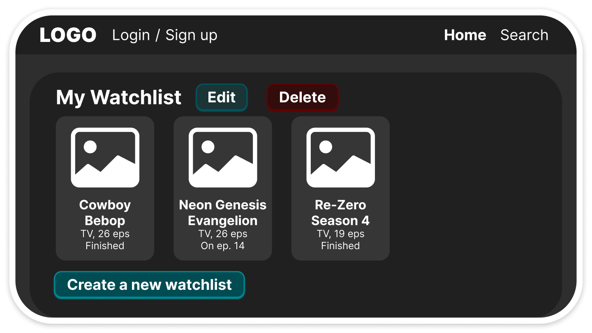
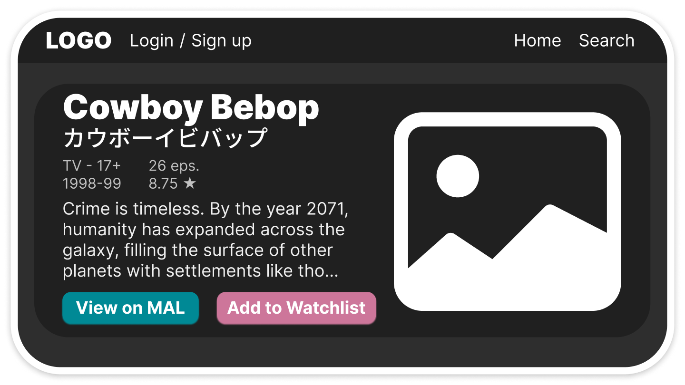
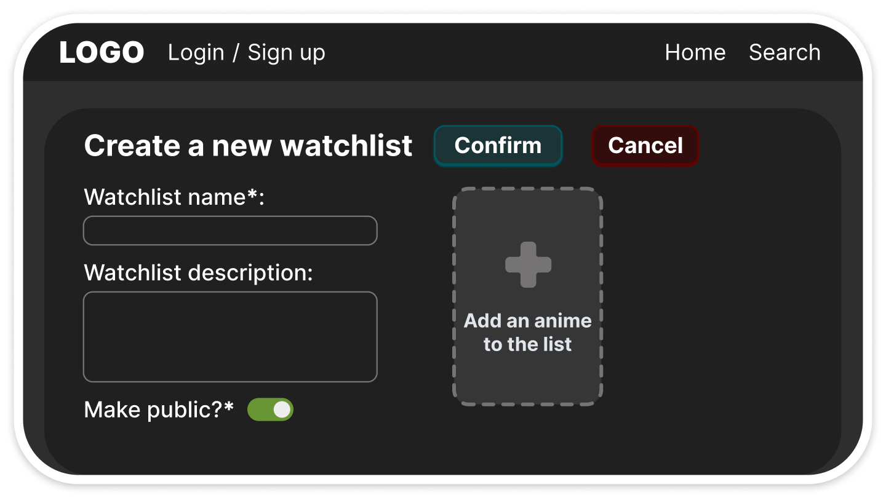
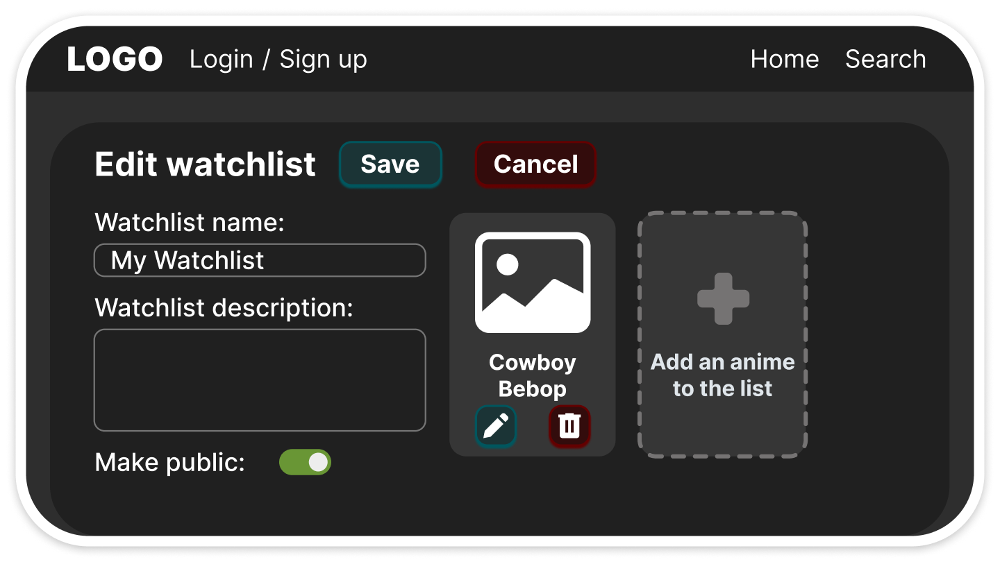
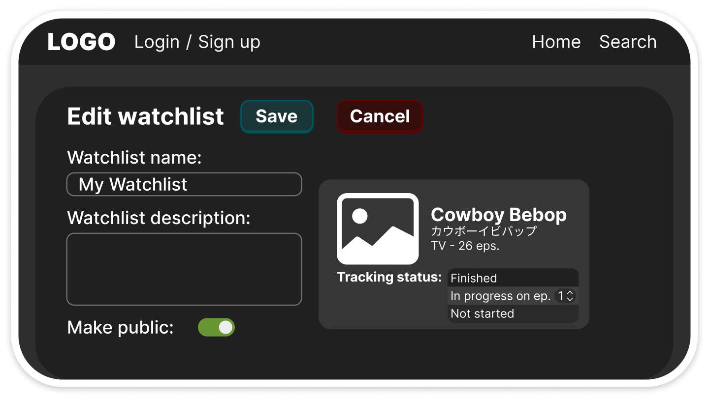

# PROJECT PROPOSAL

## 1. Problem and users
This app is for anime fans who are looking for a way to track the multiple anime TV shows they have completed, dropped, put on hold, or are currently watching across various streaming platforms. Through the data provided by the Jikan-edge REST API, our app will facilitate the creation and editing of anime watchlists, solving the problem of forgetting which episode one was on, figuring out and organizing which anime one should watch next, and search animes all in a centralized hub.

## 2. MVP Features
- A user can search through the anime database.
- A user can register for an account and sign in to create custom watch lists.
- A signed-in user can update watched episode count and completion status for each anime in their watchlist.
- A signed-in user can delete watchlist entries and watchlists.
- A signed-in user can view all their custom watchlists on the homepage.

### 2.1 Later list
- A signed-in user can discuss animes on forums.
- A signed-in user can edit anime detail pages.
- A signed-in user can join an online anime club.
- A signed-in user can search through a user list.
- A signed-in user can rate and review an anime.

## 3. External API

Our application will use the jikan-edge API to retrieve anime information. The API provides information about anime such as titles, scores, episode counts, airing status, genres, and images.

**Documentation**: https://jikan.lucashdo.com/docs

**Authentication**: No API key is required.

**Rate limits**: 30 requests per 10 seconds, and 60 requests per minute enforced across all routes.

The API will be used when a user searches for an anime. Our Express server will send a request to the external API and return anime search results to the React frontend. When the user selects an anime, our application can save the required anime information in our own MongoDB database.

### Example request: https://jikan.lucashdo.com/v1/anime/1
### Example response: 

```json
{
  "data": {
    "malId": 1,
    "title": "Cowboy Bebop",
    "score": 8.75,
    "episodes": 26,
    "status": "Finished Airing",
    "genres": [
      { "malId": 1, "name": "Action" },
      { "malId": 24, "name": "Sci-Fi" }
    ]
    ...
  },
  "meta": {
    ...
  }
}
```

**The response above is trimmed to show only the information that is relevant to our application.**

## 4. Data model draft
Our application will use MongoDB to store users' personal wwanime lists and reviews. Anime information from the external API will be used to populate an anime list item, but the user's saved data will be stored in our own database.

### User
- `_id`: ObjectId, required
- `username`: String, required
- `email`: String, required
- `password`: String, required

### AnimeListItem
- `_id`: ObjectId, required
- `userId`: ObjectId, required
- `malId`: Number, required
- `title`: String, required
- `imageUrl`: String, optional
- `totalEpisodes`: Number, optional
- `currentEpisode`: Number, required
- `status`: String, required
- `score`: Number, optional
- `createdAt`: Date, required
- `updatedAt`: Date, required

### Review
- `_id`: ObjectId, required
- `userId`: ObjectId, required
- `animeListItemId`: ObjectId, required
- `rating`: Number, required
- `comment`: String, required
- `createdAt`: Date, required
- `updatedAt`: Date, required

### Relationships
- A User can have many AnimeListItem records.
- Each AnimeListItem belongs to one User.
- A User can create many Reviews.
- Each Review belongs to one User.
- Each Review belongs to one AnimeListItem.

## 5. Endpoint list

| Method | Path                  | Description                   | Success | Errors        |
| ------ | --------------------- | ----------------------------- | ------- | ------------- |
| GET    | `/api/anime`          | Get the user's anime list     | 200     | 401, 500      |
| GET    | `/api/anime/:id`      | Get one anime                 | 200     | 404, 500      |
| POST   | `/api/anime`          | Add an anime                  | 201     | 400, 401, 500 |
| PUT    | `/api/anime/:id`      | Update an anime               | 200     | 400, 404, 500 |
| DELETE | `/api/anime/:id`      | Delete an anime               | 204     | 404, 500      |
| GET    | `/api/reviews`        | Get user's reviews            | 200     | 401, 500      |
| GET    | `/api/reviews/:id`    | Get one review                | 200     | 404, 500      |
| POST   | `/api/reviews`        | Create a review               | 201     | 400, 401, 500 |
| PUT    | `/api/reviews/:id`    | Update a review               | 200     | 400, 404, 500 |
| DELETE | `/api/reviews/:id`    | Delete a review               | 204     | 404, 500      |
| GET    | `/api/external/anime` | Search the external anime API | 200     | 400, 502      |

## 6. Wireframes

### Wireframe of the homepage showing a list of every watchlist:


### Wireframe of a detail page of an anime show:


### Wireframe of the create page of a custom watchlist:


### Wireframe of the edit page of a custom watchlist:


### Wireframe of the edit page showing capabilities to edit the user's progress in an anime:


## 7. Team roles
**API lead:** Zlata

**Frontend, repository, and pull requests lead:** Mirza

**Database lead (MongoDB):** Keziah

## Contributions are listed in CONTRIBUTIONS.md at the root of the repository (step 9).